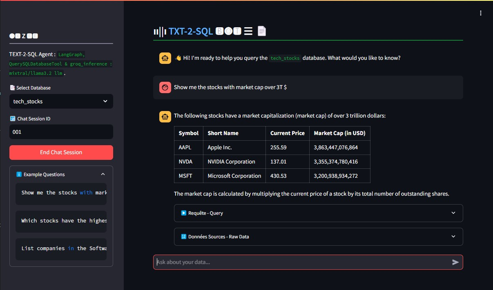

# 🤖 Chat with Databases
## 🤖 `Text to SQL` Agentic langgraph chatbot
Streamlit `Text to SQL` Agentic ChatBot app built with `langgraph workflow` :
- Workflow : `LangGraph` Workflow with text-to-query, sqlite, and memory & session management
- Inference & LLM : `Groq Inference`, Model : `llama3.2 3b`

# Steps :
- Put `GROQ_API_KEY` in `.streamlit/secrets.toml`
- Put your csv file in `/data` folder
- Use script `/utils/csv_to_sqlite.py` to create `sqlite` databases
- Run the App :
```python
pip install -r requirements.txt
streamlit run main.py
```



# ⌨ APP DOCKERFILE : 
To build the App from Dockerfile

```bash
docker build -t chatbot-app .
docker run -p 8501:8501 \
    -e GROQ_API_KEY=your_groq_api_key \
    chatbot-app
```

# 📊 LangGraph WorkFlow
LangGraph Work-Flow


